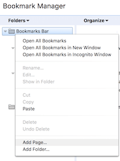
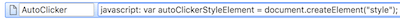

# Auto-Clicker Bookmarklet #
A bookmarklet to auto-click elements on a webpage.

## How to Install ##
**Supported Browsers**
* Chrome
* Edge
* Firefox
* Opera

1. Open your browser bookmark manager
2. Paste the [source code](AutoClicker.js) into the URL box

## How to Use ##

#### To Start Auto-clicking ####
1. Click bookmark
2. Click the element you want to auto-click

#### To Stop Auto-clicking ####
1. Click bookmark
2. Click the element you want to stop auto-clicking

## How to Customize ##
The DELAY constant in the code can be changed to adjust the clicking speed. It
represents the delay between clicks, in milliseconds. By default it is set to
1.
